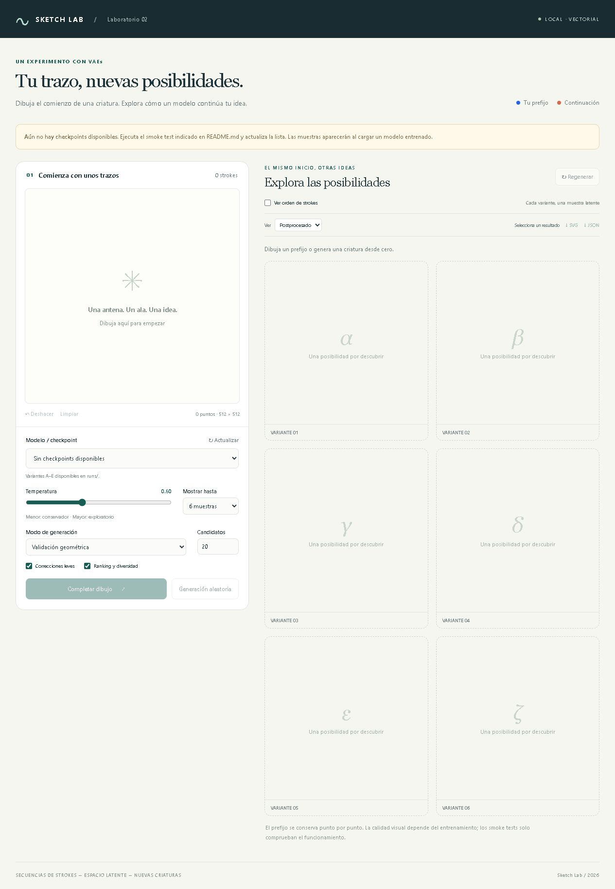
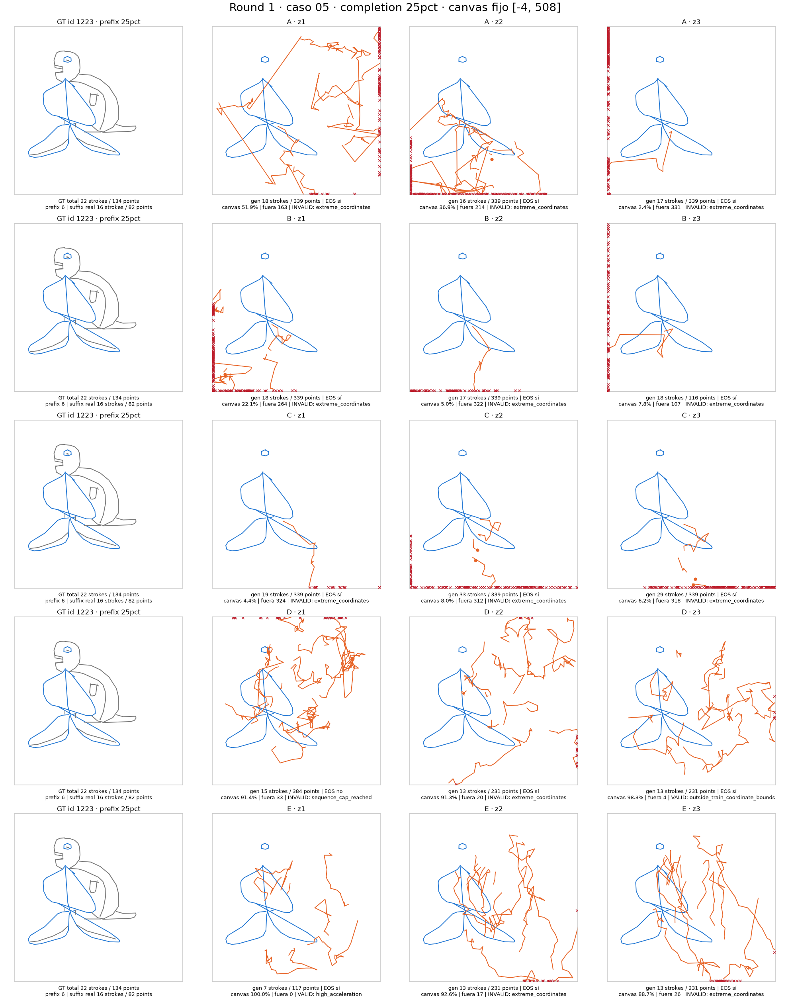
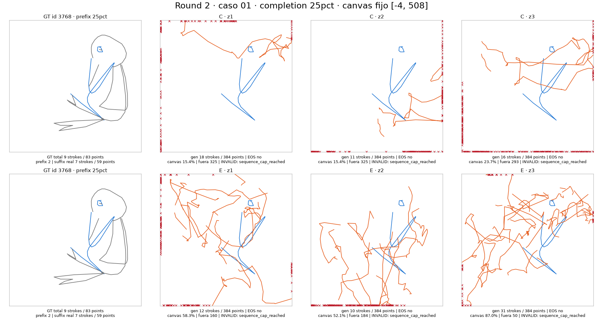
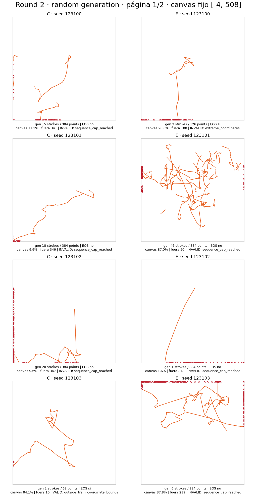
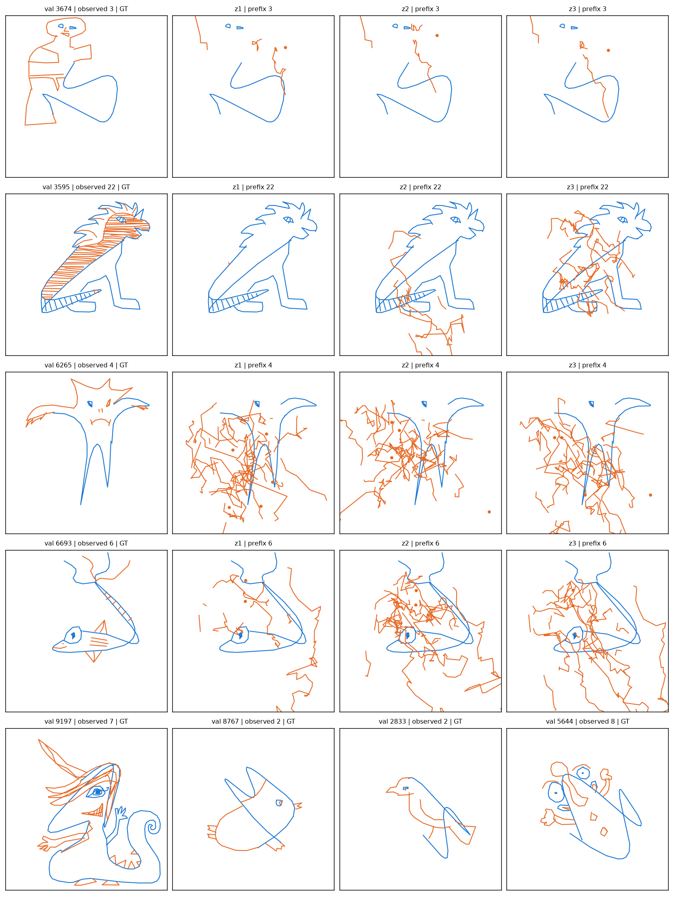

# Lab 2 — VAE for Vector Sketch Generation and Completion

Proyecto reproducible para modelar sketches vectoriales como secuencias ordenadas de strokes. El laboratorio estudia dos tareas: **generación aleatoria** desde una variable latente y **sketch completion**, donde varios valores de `z` producen continuaciones distintas para un mismo prefix.



## Objetivo

Cada sketch conserva estructura vectorial y orden de dibujo. No se rasteriza para entrenar: un sketch es una secuencia de strokes y cada stroke es una secuencia ordenada de puntos 2D. El objetivo experimental actual es entender por qué una reconstrucción teacher-forced cada vez mejor no se traduce necesariamente en samples free-running estables.

Las dos operaciones principales son:

1. **Random generation:** generar un sketch completo desde `z`.
2. **Sketch completion:** conservar exactamente los strokes observados y generar múltiples suffixes con distintos `z`.

## Dataset

El dataset autorizado ya está incluido en [`data/raw/`](data/raw/):

- `train.pkl`: 8.187 sketches, 17.331.249 bytes.
- `val.pkl`: 910 sketches, 1.891.794 bytes.

Cada archivo contiene una lista de sketches. Un sketch es una secuencia ordenada de strokes; cada stroke es un array `float32 (N, 2)` de puntos absolutos y longitud variable. Los límites de stroke representan pen-up. La codificación stroke-5 reversible añade estados de dibujo, fin de stroke y EOS sin alterar los originales. En completion, el prefix se copia desde sus coordenadas originales y se comprueba punto por punto: el modelo solo genera el suffix.

La estructura y las estadísticas verificadas están documentadas en [docs/dataset.md](docs/dataset.md).

## Modelos implementados

| Modelo | Descripción |
|---|---|
| **A — Sketch-RNN VAE** | Baseline secuencial con un latente global y decoder autoregresivo MDN. |
| **B — KL-controlled / Beta-VAE** | Variante de A con warm-up, beta reducido y free bits para conservar información latente. |
| **C — Conditional Completion VAE** | VAE secuencial entrenado también con prefixes parciales para modelar continuaciones condicionadas. |
| **D — Hierarchical Stroke-VAE** | Representación jerárquica con latente global y latentes locales por stroke. |
| **E — Hierarchical Conditional VAE** | Combina jerarquía por stroke y entrenamiento condicionado por prefixes. |

Los detalles de representación, losses y límites de comparación están en [docs/architectures.md](docs/architectures.md).

## Estado actual

El repositorio incluye representación reversible, pipeline seguro de datos, modelos A/B/C/D/E y la demo final H9/H13/H20. Los tres checkpoints necesarios para la demo están en `artifacts/models/`. Los demás checkpoints y resultados experimentales permanecen en `runs/`, que Git ignora.

## Hallazgos actuales

**Round 1** comparó A/B/C/D/E con el mismo presupuesto corto y evaluación homogénea. Después se hizo una revisión visual humana con casos VAL, prefixes y semillas fijos. **Round 2** reanudó exactamente C y E hasta 800 updates acumulados.

La reconstruction de training/validation mejoró, pero la generación autoregresiva free-running no mejoró proporcionalmente. En Round 2 aumentaron la sobre-generación y la frecuencia de llegar al límite de 384 puntos; EOS/termination empeoró y aún aparecen trayectorias fuera del canvas y scribbles.

Esto **no demuestra exposure bias**. Las hipótesis abiertas incluyen calibración de EOS, sampling y temperatura, comportamiento del MDN, drift autoregresivo acumulado y la diferencia entre inputs teacher-forced y estados producidos por el propio decoder. [docs/EXPERIMENTAL_FINDINGS.md](docs/EXPERIMENTAL_FINDINGS.md) separa lo observado de lo que todavía no sabemos.





## Demo

La demo final funciona sin entrenar. **Azul** es el prefijo dibujado y **naranja** la continuación. Necesita Python 3.11 o 3.12. Los scripts se sitúan automáticamente en la raíz del repositorio.

### Windows

En PowerShell, con Git y Python instalados:

```powershell
git clone https://github.com/salvachu/lab_generativos_2.git
cd lab_generativos_2
git switch --track origin/codex/model-f-compositional-vae
powershell -ExecutionPolicy Bypass -File .\scripts\setup.ps1
powershell -ExecutionPolicy Bypass -File .\scripts\run_demo.ps1
```

### Ubuntu

En Ubuntu 24.04 o posterior:

```bash
sudo apt update
sudo apt install -y git python3 python3-venv
git clone https://github.com/salvachu/lab_generativos_2.git
cd lab_generativos_2
git switch --track origin/codex/model-f-compositional-vae
bash scripts/setup.sh
bash scripts/run_demo.sh
```

### URL

Abre [http://127.0.0.1:8000/demo](http://127.0.0.1:8000/demo). La vista original sigue en [http://127.0.0.1:8000/](http://127.0.0.1:8000/).

### Models

| Modelo | Uso | Checkpoint |
|---|---|---|
| H20 — Recommended | Modelo final por defecto | `artifacts/models/H20/best.pt` |
| H13 — Structural | Comparación estructural | `artifacts/models/H13/best.pt` |
| H9 — Experimental | Comparación histórica | `artifacts/models/H9/best.pt` |

Cada checkpoint conserva su configuración de inferencia dentro del archivo; no hay que proporcionar una config externa. H13 y H20 usan además `features.npz` y `FEATURE_MANIFEST.json` de su propia carpeta en `artifacts/models/`, con solo los dos arrays necesarios para inferencia. Estos bancos verifican su procedencia contra `data/raw/train.pkl`, incluido en el repositorio. No se descargan modelos al arrancar.

La demo muestra **CUDA** cuando la instalación de PyTorch detecta una GPU compatible; en otro caso usa **CPU**. CUDA no es requisito. Para instalar una versión de PyTorch con CUDA, consulta la [guía oficial de instalación](https://docs.pytorch.org/get-started/locally/); en Windows, `setup.ps1 -Cuda` instala la variante CUDA 12.6 usada en este laboratorio si el equipo es compatible. `requirements-lock.txt` conserva el entorno CUDA histórico y no es necesario para ejecutar la demo.

## Tests

```powershell
.\.venv\Scripts\python.exe -m pytest -q
```

## Training

Cada comando exige un directorio de salida nuevo:

```powershell
.\.venv\Scripts\python.exe -m scripts.train --config configs\A.json --models A --output runs\comparison_A
.\.venv\Scripts\python.exe -m scripts.train --config configs\B.json --models B --output runs\comparison_B
.\.venv\Scripts\python.exe -m scripts.train --config configs\C.json --models C --output runs\comparison_C
.\.venv\Scripts\python.exe -m scripts.train --config configs\D.json --models D --output runs\comparison_D
.\.venv\Scripts\python.exe -m scripts.train --config configs\E.json --models E --output runs\comparison_E
```

Resume exacto conserva optimizer, RNG, sampler y schedule:

```powershell
.\.venv\Scripts\python.exe -m scripts.train --config configs\round2_C.json --models C --output runs\continued_C --resume runs\comparison_C\C\last.pt
```

## Evaluation

```powershell
.\.venv\Scripts\python.exe -m scripts.evaluate runs\comparison_C\C\best.pt --output runs\evaluation_C --count 8 --samples 3 --seed 2026
```

## Generation

Generación aleatoria sin prefix:

```powershell
.\.venv\Scripts\python.exe -m scripts.generate runs\comparison_C\C\best.pt --output runs\random_C --candidates 20 --top-k 6 --seed 42
```



## Completion

`configs/prefix_example.json` contiene un prefix mínimo de ejemplo:

```powershell
.\.venv\Scripts\python.exe -m scripts.generate runs\comparison_C\C\best.pt --prefix configs\prefix_example.json --output runs\completion_C --candidates 20 --top-k 6 --seed 42
```



## Próximos pasos

1. Comparar teacher-forced y free-running con un diagnóstico controlado.
2. Analizar EOS y termination por paso y por condición.
3. Hacer un sweep pequeño de sampling y temperatura.
4. Identificar la causa principal sin asumirla de antemano.
5. Aplicar un cambio mínimo y aislado.
6. Repetir el benchmark visual con los mismos casos.
7. Hacer entrenamiento largo solo después de estabilizar generation.

## Documentación

- [Investigación y decisión arquitectónica G](docs/ARCHITECTURE_DECISION.md)
- [Short de G: resultados y decisión visual](docs/G_SHORT_FINDINGS.md)
- [Inicio rápido](docs/QUICK_START.md)
- [Hallazgos experimentales](docs/EXPERIMENTAL_FINDINGS.md)
- [Dataset y representación](docs/dataset.md)
- [Arquitecturas](docs/architectures.md)
- [Geometría, validación y ranking](docs/geometry.md)
- [Informe técnico](docs/INFORME_TECNICO.md)
- [Fuentes primarias](docs/research.md)
